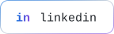

<div align="center">

<picture>
  <source media="(prefers-color-scheme: dark)" srcset="./assets/header-dark.svg" />
  
</picture>

<br><br>

<a href="https://amansriven.com"><picture><source media="(prefers-color-scheme: dark)" srcset="./assets/btn-site-dark.svg" /></picture></a>&nbsp;
<a href="https://linkedin.com/in/aman-sriven"><picture><source media="(prefers-color-scheme: dark)" srcset="./assets/btn-linkedin-dark.svg" /></picture></a>&nbsp;
<a href="mailto:sriven.aman@gmail.com"><picture><source media="(prefers-color-scheme: dark)" srcset="./assets/btn-email-dark.svg" /></picture></a>

</div>

<br>

```console
$ whoami --verbose

  focus       LLM infrastructure, multi-agent systems, model reliability
  currently   software engineering intern — healthcare AI
  before      ai engineering intern · undergraduate researcher
  interests   inference routing, RAG evaluation, distributed systems
```

<br>

### `~/stack`

<p>
  <picture>
    <source media="(prefers-color-scheme: dark)" srcset="https://skillicons.dev/icons?i=py,cpp,java,ts,pytorch,tensorflow,kubernetes,docker,aws,gcp,fastapi,flask,nodejs,postgres,mongodb&theme=dark&perline=15" />
    
  </picture>
</p>

```yaml
languages:  [ python, c++, java, typescript, sql ]
ml:         [ pytorch, tensorflow, vertex-ai, google-adk, rag ]
infra:      [ kubernetes, docker, argocd, helm, aws, gcp ]
services:   [ fastapi, flask, node, postgres, mongodb ]
```

### `~/currently-thinking-about`

```diff
+ agent orchestration at scale
+ retrieval quality over model size
+ observability for nondeterministic systems
- yaml
```

<br>

<div align="center">

<a href="https://linkedin.com/in/aman-sriven"></a>

</div>
