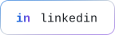

<div align="center">

<picture>
  <source media="(prefers-color-scheme: dark)" srcset="./assets/header-dark.svg" />
  
</picture>

<br><br>

<a href="https://amansriven.com"><picture><source media="(prefers-color-scheme: dark)" srcset="./assets/btn-site-dark.svg" /></picture></a>&nbsp;
<a href="https://linkedin.com/in/aman-sriven"><picture><source media="(prefers-color-scheme: dark)" srcset="./assets/btn-linkedin-dark.svg" /></picture></a>&nbsp;
<a href="mailto:sriven.aman@gmail.com"><picture><source media="(prefers-color-scheme: dark)" srcset="./assets/btn-email-dark.svg" /></picture></a>

</div>

<br>

```console
$ whoami --verbose

  role       software engineer
  school     texas a&m · cs + math · '28

  focus      backend & distributed systems
             apis · data pipelines · infra at scale

  also       applied ai / ml
             llm infra · agentic pipelines · pytorch research

  building   roleward · delta code

  prev       humana            swe intern
             jaggaer           swe intern
             tamu cares lab    ml research
```

### `~/stack`

<p>
  <picture>
    <source media="(prefers-color-scheme: dark)" srcset="https://skillicons.dev/icons?i=py,java,cpp,c,ts,js,go,rust,fastapi,react,nodejs,nextjs,pytorch,spring,mongodb,postgres,kafka,aws,azure,kubernetes,docker,redis,prometheus,grafana&theme=dark&perline=12" />
    
  </picture>
</p>

```yaml
languages:  [ python, java, c++, c, typescript, javascript, sql, go, rust ]
frameworks: [ fastapi, react, node, next.js, pytorch, spark, spring boot ]
data:       [ postgresql, mongodb, kafka, redis ]
infra:      [ aws, azure, databricks, kubernetes, docker, helm, argocd, prometheus / grafana ]
```

### `~/currently-thinking-about`

```diff
+ retry storms and provider failover
+ lease-based coordination under failure
+ agents that explain findings, not decide facts
- yaml
```

<br>

<div align="center">

<a href="https://linkedin.com/in/aman-sriven"></a>

</div>
